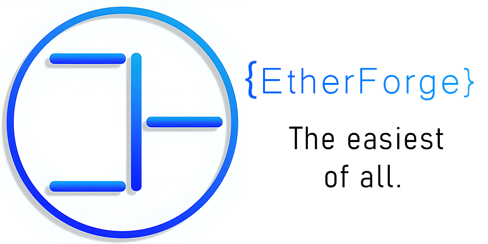

[](http://www.apache.org/licenses/LICENSE-2.0)


# EtherForge Main Blockchain
The main EtherForge code, a branch from LiskSDK.

## What is the EtherForge?
This is a cryptotoken based on LiskSDK, which is the easiest token in terms of use: transfers, sending/verifying the signature of messages, information about the blockchain. So many functions, but so simple.

### Dependencies
The following dependencies need to be installed in order to run EtherForge Application.

#### Node.js
If you are using NVM, install the correct version as shown below:

```sh
nvm install v18.16.0
```
#### Lisk Commander
It is recommended to install Lisk Commander globally with NPM (Node Package Manager), to facilitate the convenient usage of the Lisk Commander CLI.

```sh
npm install --global lisk-commander@beta
```

To check the successful installation of Lisk Commander, run the following command:

```sh
$ lisk --version
lisk-commander/6.0.0 darwin-arm64 node-v18.16.0
```

#### Starting the app
Firstly, enter the folder with app: `~/etherforge-mainsdk/`

To start main app, you need to write this: 

```sh
./bin/run 
```

If you need a help with commands, run it: 

```sh
./bin/run --help
```

### Documentation 
For further explanations, guides and tutorials, see the [official Lisk SDK documentation](https://lisk.com/documentation/lisk-sdk/v6).

## License

Copyright 2016-2023 Lisk Foundation
Copyright 2023 EtherForge


Licensed under the Apache License, Version 2.0 (the "License");
you may not use this file except in compliance with the License.
You may obtain a copy of the License at

    http://www.apache.org/licenses/LICENSE-2.0

Unless required by applicable law or agreed to in writing, software
distributed under the License is distributed on an "AS IS" BASIS,
WITHOUT WARRANTIES OR CONDITIONS OF ANY KIND, either express or implied.
See the License for the specific language governing permissions and
limitations under the License.
